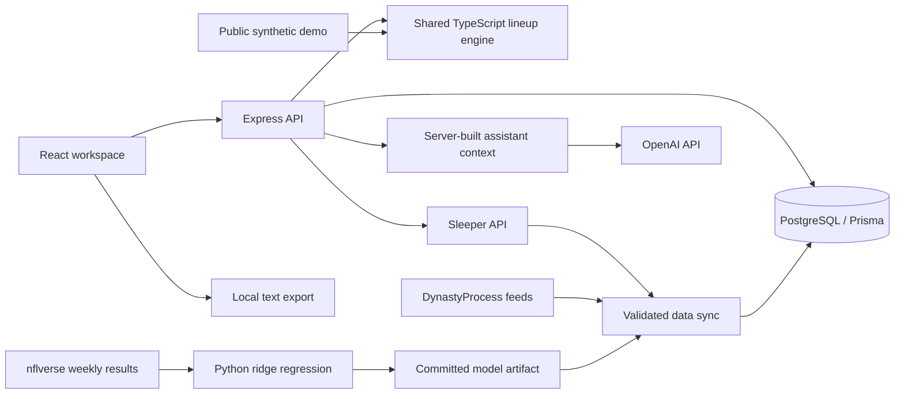

# Architecture and Decisions

## Request and Data Flow

The Render service serves the built frontend and API from one origin. PostgreSQL holds users, hashed sessions, owned teams, rosters, report snapshots, player-data batches, and projection observations. No browser request receives the OpenAI key.

## Code Boundaries

| Location | Responsibility |
| --- | --- |
| `apps/web/src/App.tsx` | Signed-in workspace, team state and request coordination |
| `apps/web/src/components/` | Lineup, matchup, league, account, and assistant views |
| `apps/web/src/lib/leagueContext.ts` | Deterministic, downloadable league snapshot |
| `apps/web/src/demo/` | Fictional fixtures and public demonstration using real components |
| `apps/api/src/routes/` | Validated HTTP contracts and ownership checks |
| `apps/api/src/services/` | External data ingestion, Sleeper import, assistant orchestration |
| `apps/api/src/lib/` | Scoring, roster-fit analysis, availability, authentication, and mapping |
| `apps/api/prisma/` | Database schema, migrations, and idempotent seed |
| `packages/shared/src/` | Shared types and deterministic lineup selection |
| `ml/` | Offline historical training and evaluation |

## Key Decisions

**Canonical data lives on the server.** Recommendation requests reference player IDs rather than trusting client-provided projections or injuries. Team updates use transactions; a failed roster update must not partially replace the saved roster. Historical reports preserve snapshots rather than recalculating old advice using today's data.

**Prediction and language generation are separate.** The lineup engine applies eligibility, availability, scoring, and projected points. The assistant explains a server-built context; it cannot change Sleeper lineups or execute transactions. A language model response is not treated as an authoritative new projection.

**Provider identity is explicit.** Sleeper IDs are joined through DynastyProcess mappings. Unknown players and unavailable projections are disclosed. Current feeds supply finished point totals, so storing custom rules does not imply those totals have been recalculated for custom scoring.

**Imports are read-only.** Entering a public Sleeper username finds public league membership. It does not prove control of that Sleeper account. Local team ownership is enforced separately through the application's session.

**External failures preserve useful state.** Data sync activates validated batches and can keep the last successful catalog. The UI distinguishes stale, missing, loading, and failed data. Exports are unavailable while the league view is stale due to local edits, loading, or an error.

**The demo has no backend dependency.** `/demo` uses fictional players and the same shared lineup engine. It makes no API requests and cannot incur AI usage. Screenshots contain no real user or league information.

## ML Evaluation Boundary

The committed artifact trains on 2021-2024 and holds out 2025. Its recorded MAE is 4.6067 versus 4.8428 for a three-game-average baseline across 4,325 held-out player-games. These numbers describe that historical experiment, not current provider accuracy or fantasy win rate.

Important limitations:

- RidgeCV's internal regularization selection is not a season-forward validation procedure.
- Examples are observed player-games with sufficient history, not every player who might be inactive that week.
- The displayed range is based on historical residual spread, not a calibrated prediction interval.
- Forecasts are PPR-only and do not independently incorporate current injury reports.
- Future provider comparisons need archived, same-week forecasts and outcomes collected before results are known.

## Verification Map

- `apps/api/src/app.test.ts`: authentication, ownership, validation, atomic writes, reports, and canonical recommendation behavior against PostgreSQL.
- Service and library tests: provider fixtures, scoring, trade and waiver rules, freshness, and AI failure handling.
- Web tests: export formatting, clipboard failure, downloads, and saved-report behavior.
- `apps/web/e2e/demo.spec.ts`: real Chromium desktop/mobile navigation, injury substitution, clipboard/download equality, overflow, and no backend calls.
- GitHub Actions: clean installation, generated Prisma client, typecheck, production build, database tests, and browser checks.

The browser suite covers the public demo, not the entire authenticated journey. Operational gaps and release steps are tracked in [operations](operations.md).
